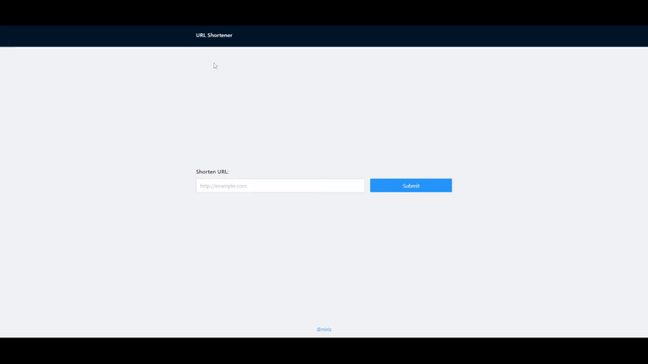
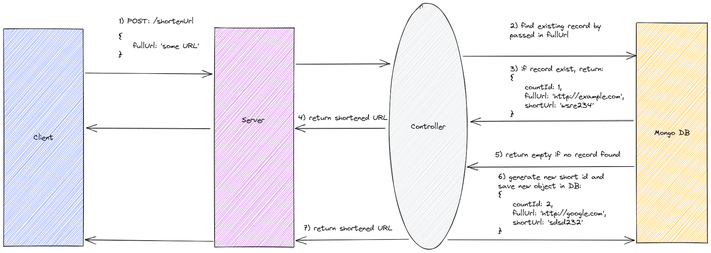
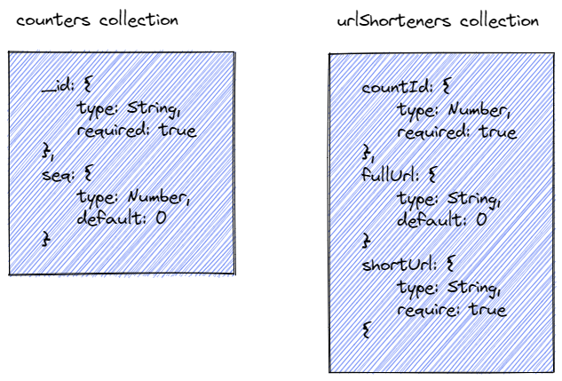
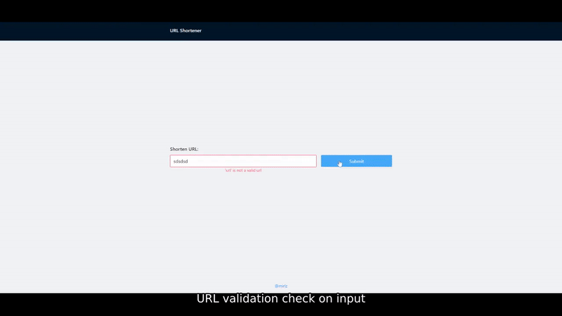

# URL Shortener
An application that takes in a full URL and generate a shortened link.

 - Sample request: http://google.com
 - Sample output: http://exa.mple/sadohdr



### General E2E Flow



### DB Collections 


1.  A user enters a long URL.
2.  The service will check if the long URL already exists in the database or not. If it does, the shortened URL will be returned.
3.  If not, increment counter's seq by 1, return the new counter 
4. Convert the new counter with base62([a-z][A-Z][0-9]) to generate a new unique string.
	- if the length generated is shorter than a given length, add random bits to counter (using timestamp + random figure) and convert again
	- slice the converted string and return first 7 characters
5.  Then, we concat that tiny unique string with our domain to become a short URL.
6.  We store everything in the database according to the model (urlShorteners) in the image above.

This project is built using node version v16.15.0.

# Server

## Stack
- mongodb
- mongoose
- express
- mocha / sinon
- node

## Installation

```sh
cd server
npm i
```
For development:
```sh
npm run dev 
npm run test // to run test scripts in src/test folder
```
To start the project: 
```sh
npm run start
```
## ENV Variables
```sh
PORT=3333 // port to run server on, defaults to 3000

dbName=urlShortener // database name
dbHost=localhost // data base host
webHost=http://localhost:3333 // used as base url
```
## API Endpoints

### POST [/shortenUrl]
    
-   **Body Object**
	```sh
    {
	    longURL: 'http://example.com'
    }
    ```
-   **Success Response:**
    
    -   **Code:**  200  
        **Content:**  `{ data : 'http://exam.ple/dsf23df }`
        
-   **Error Response:**
    
    -   **Code:**  400 Error  
        **Content:**  `{ error : "Invalid URL" }`
      
### GET [/:shortId]
    
**URL Params**

**Required:**

`shortId=[string]`

-   **Success Response:**
    
    -   **Code:**  200  
        **Content:**  `{ data : 'http://example.com }`
        
-   **Error Response:**
    
    -   **Code:**  404 Error  
        **Content:**  `{ error : "Not found" }`
        
## Client

### Validation Flow



### Libraries / stack
- react
- react-router-dom
- mobx
- mobx-react-lite
- axios
- antd frontend library
- sass

## Installation

```sh
cd client
npm i
```
For development:
```sh
npm run css:watch // auto convert scss file to css file on save
```
To start the project: 
```sh
npm run start
```
